# Let's dance together!
## zip 密码

M00NL1T@9X1E3VH0KQ6z

```java
A capital letter with two tall peaks and a valley between them
A digit shaped like a hollow full moon
A digit shaped like a hollow full moon
A capital letter built from two tall walls and a slanting bridge

Shape like a standing right angle
A number, shape like a lonely straight line
Shape like a tall column with a flat top
A special character, lowercase a surrounded by a circle

带尾巴的圆形的数字
像横着的沙漏形状
像小棍子的数字
两个叠起来的缺少右侧的盒子

Numbers with a small part missing in two rings.
Two slashes that do not intersect.
A segment of a ladder.
Numbers that look like small round holes.

two diagonal lines meeting at a point
a circle with one vertical side
A circle pokes out its head
Lowercase letter, parallel lines are connected by a line

Unless specifically mentioned, the default is uppercase letters.
```

### **黄道杀手密码**

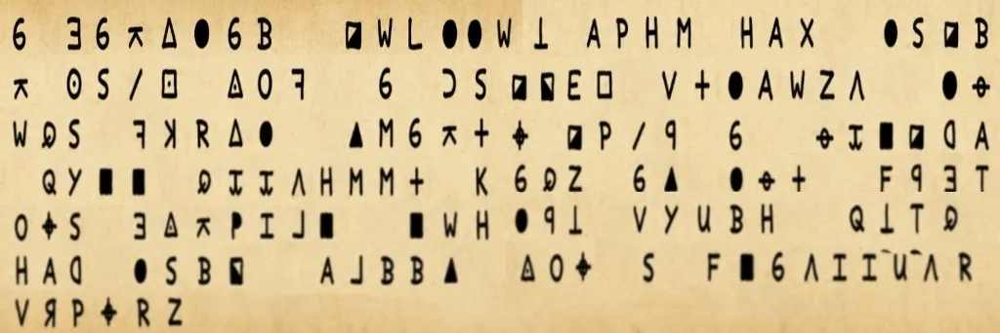

- A capital letter with two tall peaks and a valley between them
- A digit shaped like a hollow full moon
- A digit shaped like a hollow full moon
- A capital letter built from two tall walls and a slanting bridge
- M00N

黄道杀手密码——破译Z340 Z408代码在线

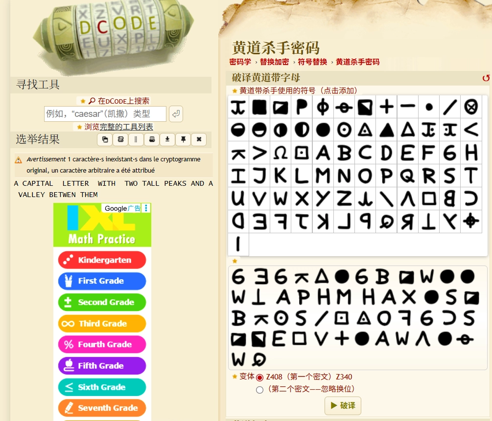

### 原神-稻妻文

```java
Shape like a standing right angle
A number, shape like a lonely straight line
Shape like a tall column with a flat top
A special character, lowercase a surrounded by a circle
```

L1T@

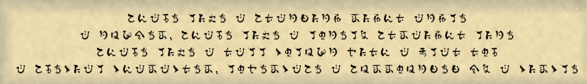

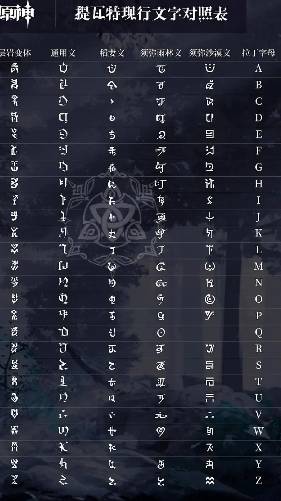
### 

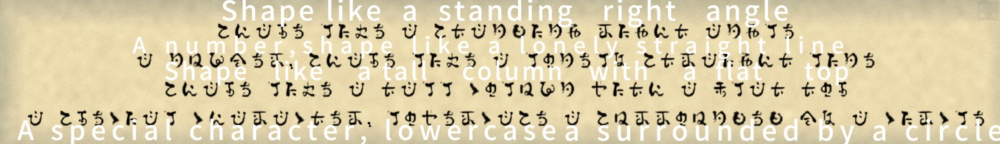

小篆

```java
带尾巴的圆形的数字
像横着的沙漏形状
像小棍子的数字
两个叠起来的缺少右侧的盒子
```

9X1E

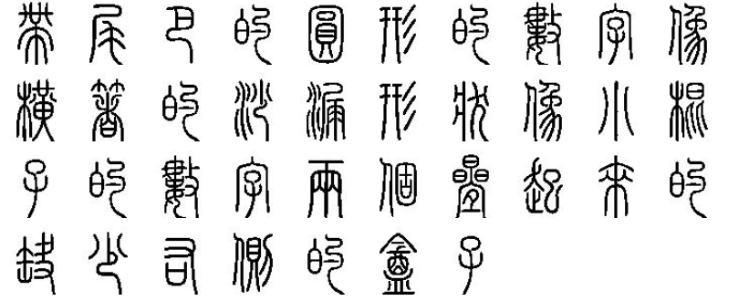

小篆没什么说的，最简单的一个

### 为美好的世界献上祝福！

```java
Numbers with a small part missing in two rings.

Two slashes that do not intersect.

A segment of a ladder.

Numbers that look like small round holes.
```

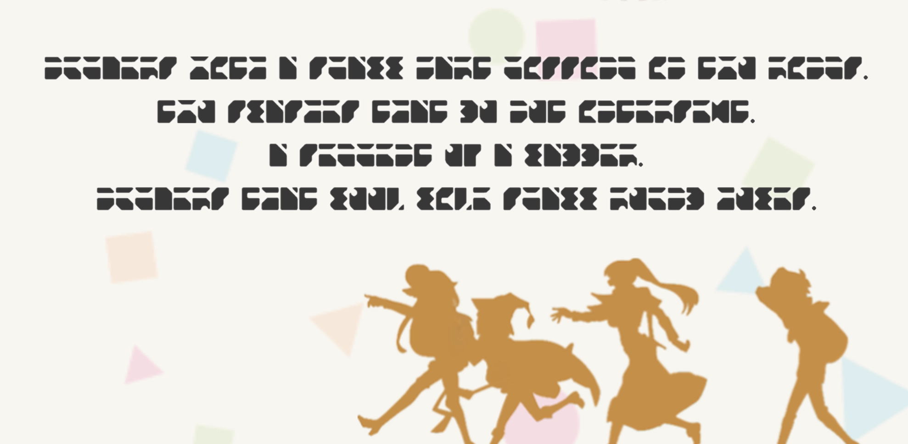

3VH0

字符表

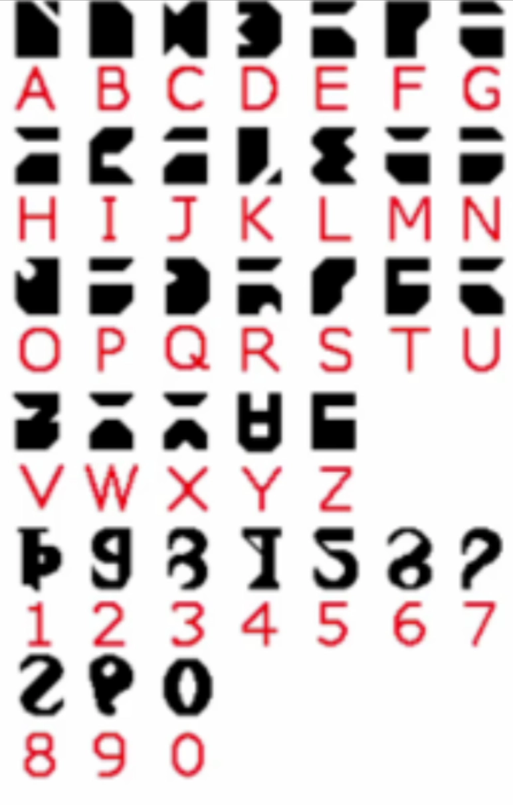

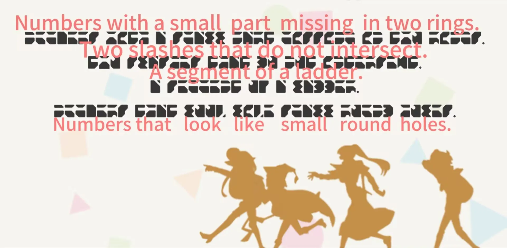

### 星球大战

KQ6z

```java
two diagonal lines meeting at a point
a circle with one vertical side
A circle pokes out its head
Lowercase letter, parallel lines are connected by a line
```

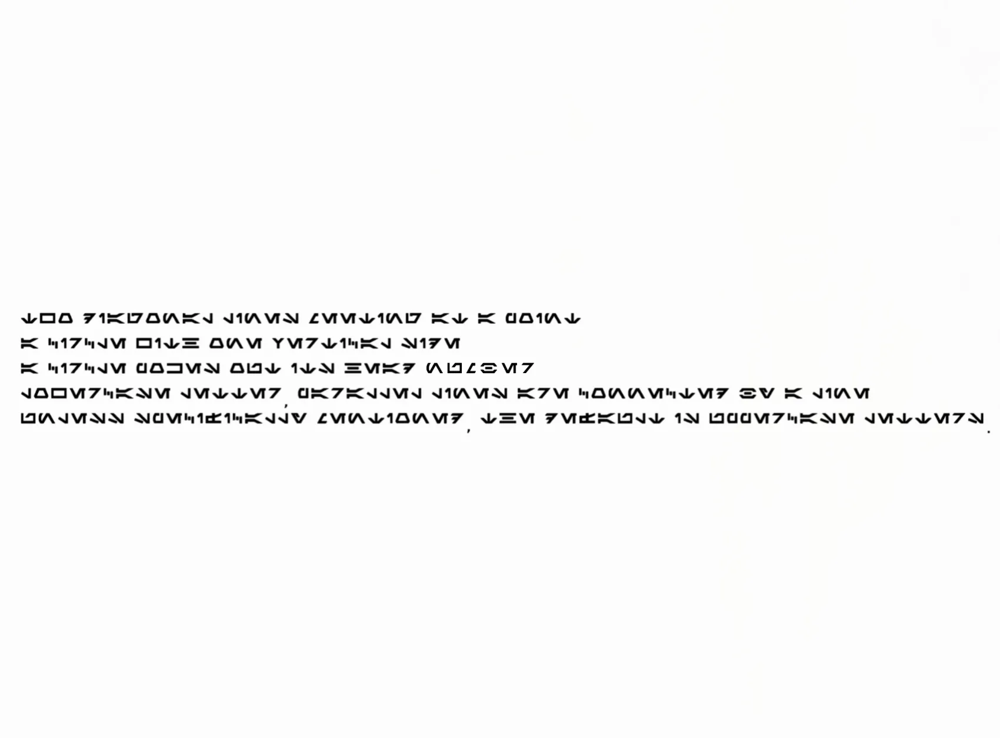

有的师傅可能调到了

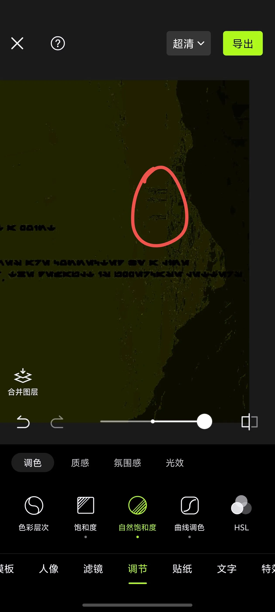

原图：

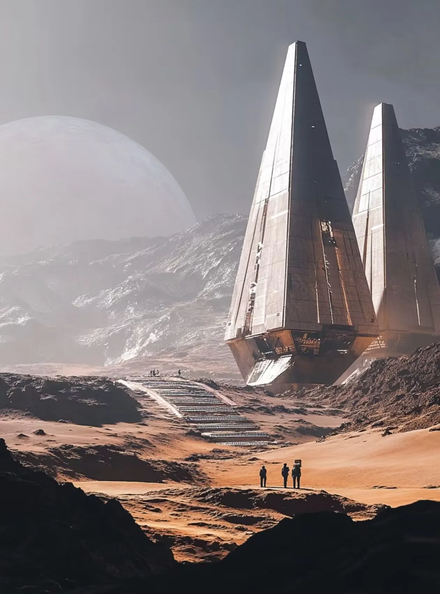

https://starwars.fandom.com/wiki/Aurebesh

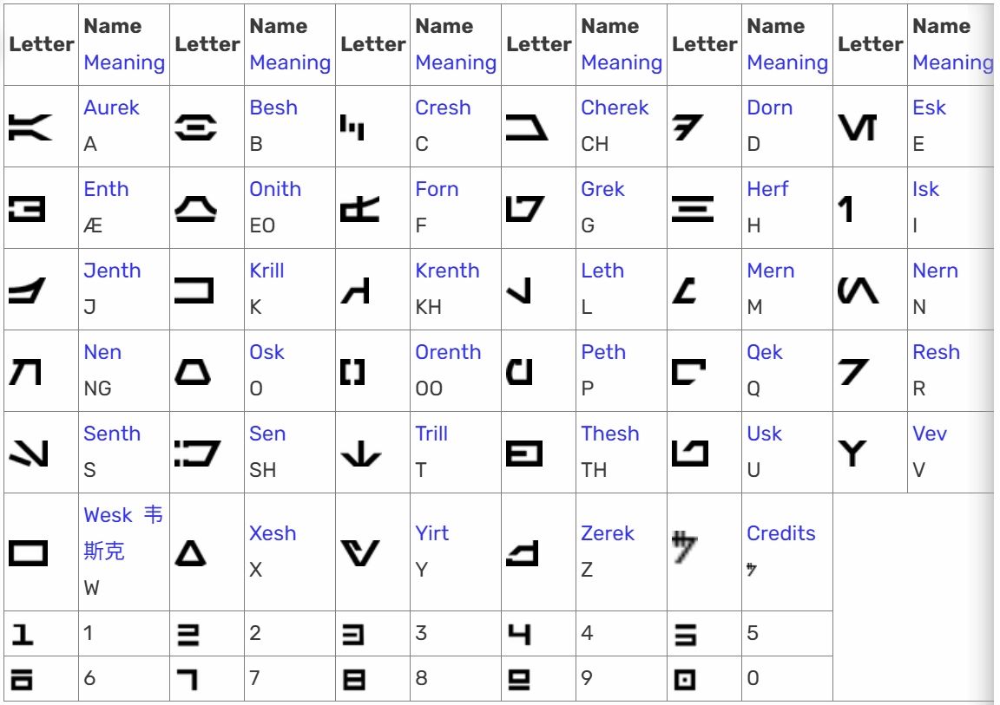

## rabbit

Dancing Men Cipher | Boxentriq

解出来是KEY IS 3YC1OVERSYC

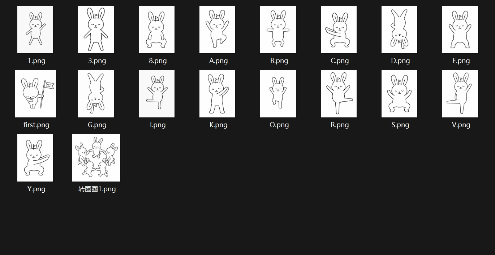

SCTF{You_can_solve_this? Really? I_dont_believe}